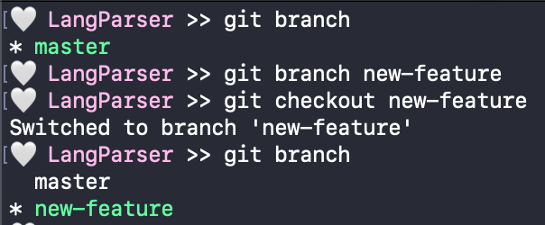
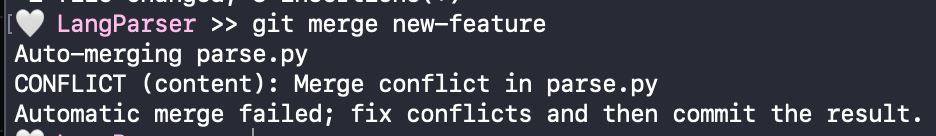
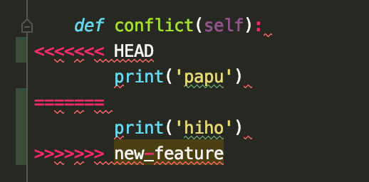

# Git Tutorial 👾

Hello 😃 Let's learn how to use git from command line! Make sure you have git installed before continuing.  

## 1. What is git ❓

Git is the most popular version control system, which means it helps track and manage changes to files. 
Git is also distributed, which means the local copy of your code is a complete version control repository (repo). 
Local repos are stored on your local machine make it easy to work offline or remotely. 
On the other hand, remote repos are stored on servers (i.e. Github) and act as a hub for collaboration on the same project or codebase. 
  
There are tons of additional features to git that make it a great tool for programmers of all kinds, but first let's learn how to clone from a remote repo to local. 
This tutorial will use a [repo for a parser project](https://github.com/kathyyliu/LangParser) as an example, but all the shown steps can also be generalized to any git repo. 

## 2. Clone 👯
  
In general, cloning in git is used to make a copy of an existing repository, but is most commonly used make a local copy of a remote repo.
To start, go to the folder you want the repo to be in using terminal and use command `git clone <repo url>`.
The result should look something like: 
  

  

Now, we can see that a new copy of the repo is on our machine!

## 3. Stage & Commit ✅

After we work on our new local repo for a bit, we might want to use git to save the current state of our files into a commit. 
Git tracks changes to a file as insertions and deletions from the previous commit.
For example, in the refactoring of the method below, git tracks that line 161 was added to/inserted, and lines 167-8 were deleted from the previous commit.
  

   
Before making a commit we must stage the all the files we want the commit to include. 
Thus, staging allows us to pick and chose exactly which modified files we want to commit to make cleaner commits and project history.
The command to stage files is  `git add <file1 file2 ...>`.
  
We can also use `git status` to check which files are already staged or available to stage. 
Once we are satisfied with the staged files, create a commit with all of the staged files with `git commit -m "<message>"`.
All commits must be accompanied with a message (typically <50 characters long and starting with a capitalized verb in the imperative) that provides useful information about what has changed and why.
  

  

  

## 4. Stash 🗃

But what if we want to save our changes without making a commit?
With `git stash`, git will "stash" our uncommited changes to tracked files and revert the file to the last commit. 
Now, we are free to make more changes or perform other git commands.
Whenever we want to reapply our stashed changes, we can use `git stash apply`, which will restore the stashed changes on our files.

## 5. Branch 🌳

In larger projects, branches are often used to keep separate versions of the main code base. 
When a new branch is made with `git branch <branch name>`, it is always an offshoot of an existing branch.
Thus, before any additional branches are created, all commits are actually part of a branch called "main" (or "master") that is usually used to track the primary, stable version of the code.
  
To "move" to a different branch, we use `git checkout <branch name>`.
The provided name must be an existing branch in the repo, which can be checked by listing all branches with `git branch`.
When checked out to another branch, files will be converted the state in the last commit on that branch.
Therefore, all further commits will be building off of the branch we are checked out on, and any changes must be stashed or commited before checking out to another branch (that contains its own commits).
  

  

  

## 6. Merge 🚙

Let's say you created a branch to write a new feature and now want to combine it back with your main code base after checking for bugs.
That means we need to *merge* the branch containing the feature with our main branch.
To start a merge, checkout to the branch we want to merge into (in this case, main,) and use `git merge <merged branch>`.
  
Now, one of two things could happen. 
The first is that the contents of the two branches are not conflicting and git performs a fast-forward merge, where the new head (tip) of the branch becomes the merged branch's tip. 
The other is a **merge conflict**, where the contents of one or more files are conflicting and Git cannot automatically determine which to keep in the resulting branch.
If a merge conflict occurs, the merge will fail until we resolve the conflict. 

  
  

  
The most straightforward way to resolve the conflict would be to edit the indicates parts of each file until there are no more conflicts.
However, many IDEs offer easier ways to deal with merge conflicts in a GUI.

