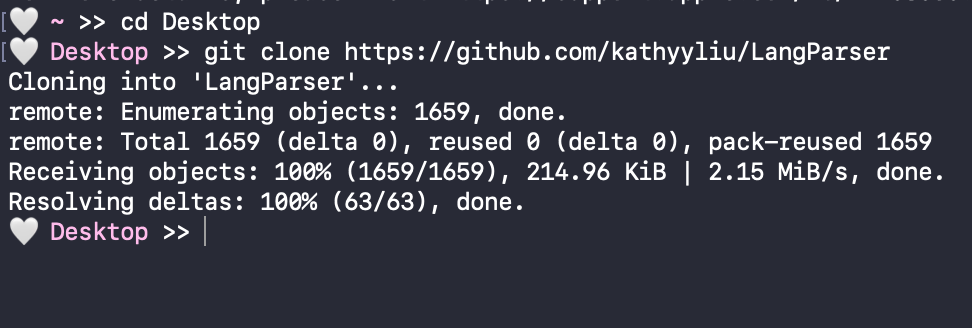
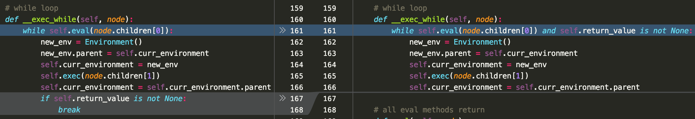
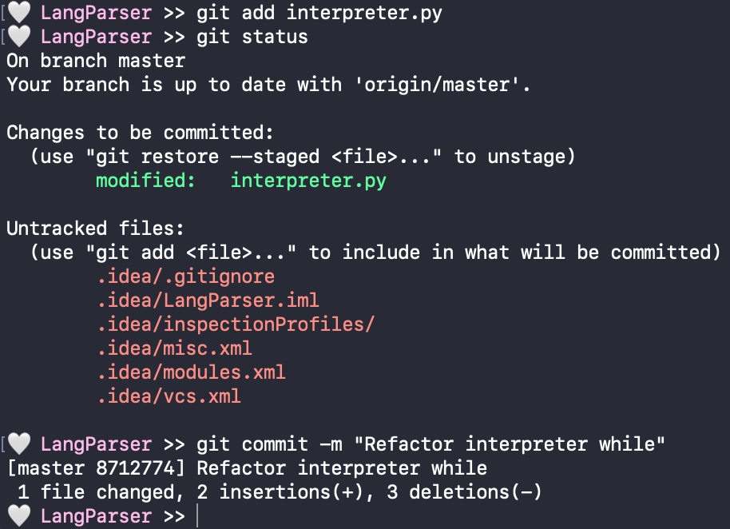

# Git Tutorial 👾

Write a follow-along tutorial for CS students that teaches them how to use git from the command line. The tutorial should use a small coding project as the context for the reader to apply git commands, with the goal that students will be able to use git for their own projects afterwards. Your tutorial must cover the use of stashes and branches, and one of either rebasing or merging. You are not required to go into detail about git internals such as the commit graph, although you are also not prohibited from doing so; use your own judgment for how much detail to present given the goal of the tutorial.

This assignment has no page constraints, and you are encouraged to include images and other supporting elements to make the tutorial easier to follow. Your tutorial should be submitted as a GitHub URL, which should include a Markdown file that could be read online.

Hello 😃 Let's learn how to use git from command line! Make sure you have git installed before continuing. 

## 1. What is git?

Git is the most popular version control system, which means it helps track and manage changes to files. 
Git is also distributed, which means the local copy of your code is a complete version control repository (repo). 
Local repos are stored on your local machine make it easy to work offline or remotely. 
On the other hand, remote repos are stored on servers (i.e. Github) and act as a hub for collaboration on the same project or codebase. 
  
There are tons of additional features to git that make it a great tool for programmers of all kinds, but first let's learn how to clone from a remote repo to local. 
This tutorial will use a [repo for a parser project](https://github.com/kathyyliu/LangParser) as an example, but all the shown steps can also be generalized to any git repo. 

## 2. Clone
  
In general, cloning in git is used to make a copy of an existing repository, but is most commonly used make a local copy of a remote repo.
To start, go to the folder you want the repo to be in using terminal and use command `git clone <repo url>`.
The result should look something like: 
  

  

Now, we can see that a new copy of the repo is on our machine!

## 3. Stage & Commit
After we work on our new local repo for a bit, we might want to use git to save the current state of our files into a commit. 
Git tracks changes to a file as insertions and deletions from the previous commit.
For example, in the refactoring of the method below, git tracks that line 161 was added to/inserted, and lines 167-8 were deleted from the previous commit.
  

   
Before making a commit we must stage the all the files we want the commit to include. 
Thus, staging allows us to pick and chose exactly which modified files we want to commit to make cleaner commits and project history.
The command to stage files is  `git add <file1 file2 ...>`.
  
We can also use `git status` to check which files are already staged or available to stage. 
Once we are satisfied with the staged files, create a commit with all of the staged files with `git commit -m "<message>"`.
All commits must be accompanied with a message (typically <50 characters long and starting with a capitalized verb in the imperative) that provides useful information about what has changed and why.
  

  

## 4. Stash
But what if we want to save our changes without making a commit?
With `git stash`, git will "stash" our uncommited changes to tracked files and revert the file to the last commit. 
Now, we are free to make more changes or perform other git commands.
Whenever we want to reapply our stashed changes, we can use `git stash apply`, which will restore the stashed changes on our files.

## 5. Push & Pull

## 6. Merge
