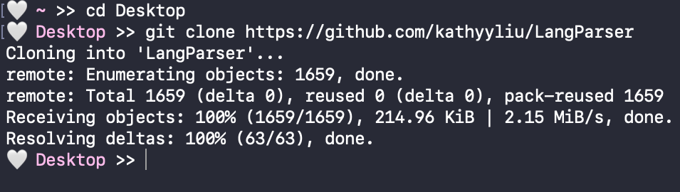

# Git Tutorial 👾

Hello 😃 Let's learn how to use git from command line! Make sure you have git installed before continuing.  

## 1. What is git ❓

Git is the most popular version control system, which means it helps track and manage changes to files. 
Git is also distributed, which means the local copy of your code is a complete version control repository (repo). 
A **repo** represents a program or project and contains all of the files related to it, such as code, readme's, and static data.
**Local repos** are stored on your local machine make it easy to work offline or remotely. 
On the other hand, **remote repos** are stored on servers (i.e. Github) and act as a hub for collaboration on the same project or codebase. 
  
There are tons of additional features to git that make it a great tool for programmers of all kinds, but first let's learn how to clone from a remote repo to local. 
This tutorial will use a [repo for a parser project](https://github.com/kathyyliu/LangParser) as an example, but all the shown steps can also be generalized to any git repo. 

## 2. Clone 👯
  
In general, **cloning** in git is used to make a copy of an existing repository, but is most commonly used make a local copy of a remote repo.
For example, let's say you want to contribute to an existing opensource project on Github. 
The code for that project will then be in a repo on Github, and you will want to clone the repo to work on the code on your local machine (i.e. in an IDE on your computer). 
  
To start, go to the folder you want the repo to be in using terminal and use command `git clone <repo url>`.
The result should look something like: 
  

  

  
Now, we can see that a new copy of the repo is on our machine! 
The new, cloned repo will be automatically tracked by git, meaning that you will be able to perform any of the git functions on the repo, like the ones in the rest of this tutorial. 
Although this repo is now separate from the original, remote repo on Github, git still "knows" the remote is the origin of the local repo, which is especially important for push and pull commands. 
These two features are the biggest differences between cloning a repo and just downloading the repo as a zip file. 

## 3. Stage & Commit ✅

After we work on our local repo for a bit, we might want to use git to save the current state of our files into a **commit**. 
Thus, commits can be thought of as a snapshot of the repo at the time of committing, and are also identified by its unique hash. 
The way git saves this snapshot is by saving only the changes to a file as insertions and deletions from the previous commit. 
For example, in the refactoring of the method below, git tracks that line 161 was added to/inserted, and lines 167-8 were deleted from the previous commit.
  

   
Before making a commit we must "**stage**" the all the files we want the commit to include. 
Staging a file means putting a file tracked by git that has been modified since the last commit into the **staging area**, which is like a holding area for files. 
To start tracking a new file with git, that file also needs to be statged. 
Staging allows us to pick and chose exactly which modified files we want to commit to make cleaner commits and project history. 
This is especially important because it is generally good practice to commit with the intention of never undoing it (although undoing a commit is possible in the case of mistakes). 

The command to stage files is  `git add <file1 file2 ...>`.
  
We can also use `git status` to check which files are already staged, or available to stage. 
Once we are satisfied with the set of staged files, create a commit with all of the staged files with `git commit -m "<message>"`.
All commits must be accompanied with a message (typically <50 characters long and starting with a capitalized verb in the imperative) that provides useful information about what has changed and why.
  

  

  

## 4. Stash 🗃

But what if we want to save our changes without making a commit?
With `git stash`, git will "**stash**" away our un-committed changes to tracked files and unapply those changes. 
Once you execute the command, you will see the contents of your files have reverted the file to the last commit, the last saved "snapshot" of your repo. 
Thus, if you make changes again and stash again, you can see all of your stashes using `git stash list`.
  
Now, we are free to make more changes or perform other git commands.
Whenever we want to re-apply our stashed changes, we can use `git stash apply` if we want to keep that stash saved in our list, or `git stash pop` if we want to delete the stash after re-applying.
Re-applying a stash will restore the saved changes within the stash onto our files. 
  
It should be noted that stashes do not and should not replace commits, and instead is like a convenience tool that helps make the commit history cleaner.

## 5. Branch 🌳

In larger projects, **branches** are often used to keep separate versions of the main code base. 
A programmer may create a branch so that they can work on a new feature, or fix a bug, or experiment on the repo, isolated from but in parallel with the versions of the repo in other branches. 
For example, a programmer can start writing a feature1 on its own branch, then switch to another branch to quickly fix a bug, then switch back to writing feature1, all without affecting the main code base.
  
When a new branch is made with `git branch <branch name>`, it is always an off-shoot of an existing branch.
Thus, before any additional branches are created, all commits are actually part of a branch called "main" (or "master") that is usually used to track the primary, stable version of the code. 
In this way, if a repo is like a tree, then "main" is like the trunk of the tree, which may have branches coming out of it, and more branches from those branches.
The list of all of the branches in a repo, as well as which branch is currently being used, can be viewed with `git branch`.
  
To look at or work on a different branch, we can **checkout** the branch using `git checkout <branch name>`.
When checked out to another branch, files will be converted to the state of the last commit on that branch.
Therefore, all further commits will be building off of the branch we are checked out on, and any changes must be stashed or commited before checking out to another branch (that contains its own commits).
  

  

  

## 6. Merge 🛣

Let's say you created a branch to write a new feature, finish it, and now want to combine it back with your main code base after checking for bugs.
That means we need to **merge** the branch containing the feature with our main branch. 
The goal of a merge is to combine the changes made to the repo between two branches into one branch that contains the changes of both branches. 
To start a merge, checkout to the branch we want to merge into (in this case, main,) and use `git merge <merged branch>`.
  
Now, one of two things could happen. 
The first is that the contents of the two branches are not conflicting and git performs a fast-forward merge, where the new head (tip) of the branch becomes the merged branch's tip. 
In other words, the merge effectively applies the commits from the branch on top of the last commit from main, making the last commit from the branch the latest snapshot of the repo on main.
  
The other is a **merge conflict**, where the contents of one or more files are conflicting and git cannot automatically determine which to keep in the resulting branch. 
The conflict usually results from competing changes are made to the same line of a file. 
For example, if on the main branch, line 8 is deleted, but in the merging branch, line 8 is modified--should the resulting merged branch show line 8 as deleted or modified?
If a merge conflict occurs, the merge will fail until we resolve the conflict. 

  
  

  
The most straightforward way to resolve the conflict would be to edit the conflicting portions of each file until there are no more conflicts.
However, many IDEs offer easier ways to deal with merge conflicts in a GUI, such allowing the user to manually choose which branch to accept changes from.

